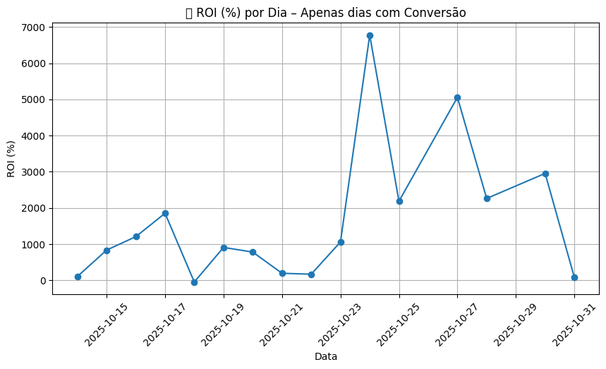
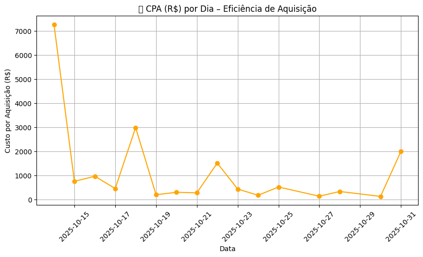
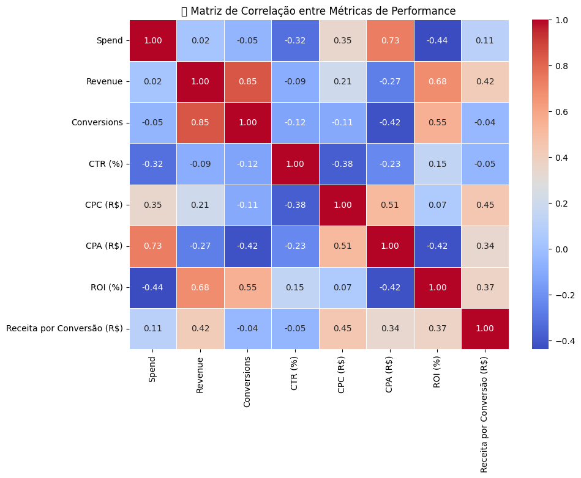
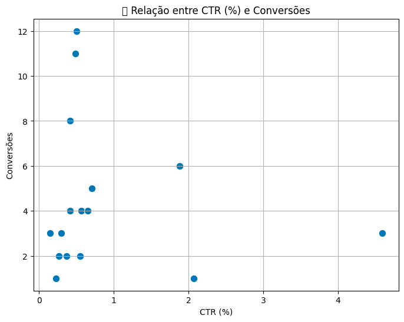
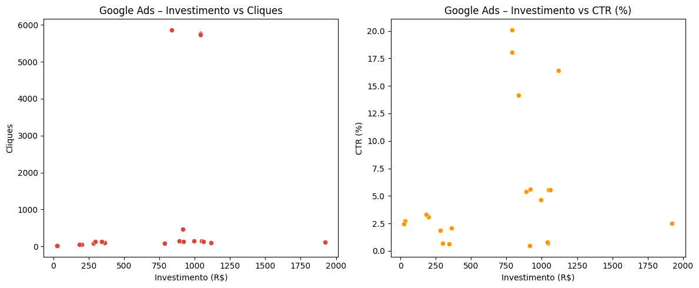
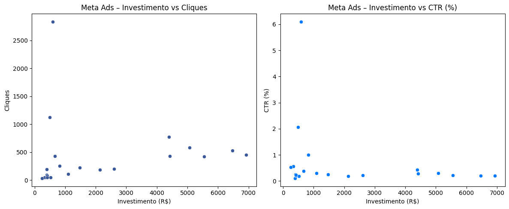
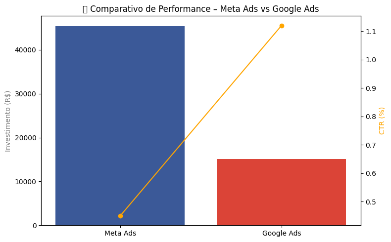

# 📊 SCS – Análise de Performance 360°

> Estudo real de performance de campanhas digitais, analisando ROI, CPA, CTR e comportamento de investimento através de dados tratados em **Python** com **Pandas**, **Matplotlib** e **Seaborn**.  
> O projeto demonstra a aplicação prática de análise de dados no marketing, combinando visão técnica e estratégica.

---

## 🎯 Objetivo

O projeto **SCS – Análise de Performance 360°** teve como meta avaliar a eficiência de campanhas de mídia paga, identificando **quais canais, dias e criativos** geraram maior **retorno sobre investimento (ROI)** e menor **custo por aquisição (CPA)**.  

A análise foi guiada por quatro perguntas principais:

- Quais canais entregam o **maior ROI e menor CPA**?  
- O desempenho dos **criativos em vídeo** influencia as conversões?  
- As **metas de rentabilidade** foram atingidas?  
- Existem **padrões de comportamento** entre dias, públicos e formatos?

---

## ⚙️ Metodologia

A análise foi conduzida em **Python**, utilizando as seguintes bibliotecas:

- **Pandas** → limpeza, unificação e manipulação dos dados  
- **Matplotlib / Seaborn** → criação das visualizações  
- **NumPy** → cálculos estatísticos e correlações  

**Etapas principais:**
1. Limpeza e padronização dos dados (Meta Ads e Google Ads).  
2. Filtragem de dias sem receita ou conversão.  
3. Cálculo de métricas derivadas (ROI, CPA, CTR, CPC, Receita/Conversão).  
4. Análise de correlação entre métricas de performance.  
5. Visualização e comparação entre canais com gráficos gerados em Python.

---

## 📈 Métricas-Chave (Ajustadas)

| Indicador | Valor |
|------------|--------|
| CTR médio | **0,89%** |
| CPC médio | **R$ 5,33** |
| CPA médio | **R$ 1.149,92** |
| ROI médio | **1.645,81%** |
| Investimento considerado | **R$ 44.010,14** |
| Receita total | **R$ 456.526,21** |

Esses valores refletem apenas os dias com **receita e conversão válidas**, garantindo uma leitura precisa da performance real.

---

## 🔍 Análises Principais

### 💰 Canais e Eficiência

- **Meta Ads** concentrou cerca de 75% do investimento total, gerando **maior volume de conversões e receita**.  
- **Google Ads** apresentou **maior eficiência de mídia**, com **CTR de 1,12%** e **CPC 7x menor** que o Meta.  

📊 **Conclusão:**  
O Meta Ads é o canal de **escala**, enquanto o Google Ads se destaca pela **eficiência e custo-benefício**.  
A combinação dos dois entrega **equilíbrio entre volume e rentabilidade**.

---

### 🎥 Impacto dos Criativos em Vídeo

Os dias com veiculação de criativos em vídeo coincidiram com os **melhores resultados de ROI e CPA**, destacando o poder da comunicação visual:

- ROI acima de **5.000%**  
- CPA abaixo de **R$ 200**  
- CTR entre **1,8% e 2,0%**

📈 **Conclusão:**  
O formato em vídeo teve **impacto direto na taxa de conversão**, provando que **conteúdo criativo e dados analíticos** são complementares na performance digital.

---

### 📊 Correlações de Performance

| Relação | Correlação |
|----------|-------------|
| CTR (%) × Conversões | **0.85** |
| Investimento × CPA | **0.73** |
| ROI × Receita | **0.68** |

🧠 **Interpretação:**  
- CTR alto → mais conversões.  
- Investimentos mal distribuídos aumentam o CPA.  
- ROI tem forte ligação com eficiência criativa e conversão.

---

## 🏆 Resultados em Destaque

| Ranking | Métrica | Data | Valor |
|----------|----------|------|--------|
| 🥇 | **Maior ROI** | 24/10 | **6.777%** |
| 🥈 | **Menor CPA** | 30/10 | **R$ 126,88** |
| 🥉 | **Maior CTR** | 20/10 | **4,59%** |

Esses períodos representam o **ponto ótimo entre investimento, criativo e público**, onde o ROI atingiu seu máximo e o CPA seu menor valor.

---

## 💡 Insights Estratégicos

1. **Concentrar investimento nos dias de alta performance** (picos de ROI e CTR).  
2. **Manter criativos em vídeo** como formato principal de conversão.  
3. **Usar Google Ads para descoberta e Meta Ads para fechamento.**  
4. **Automatizar relatórios de ROI e CPA** via Python.  
5. **Testar novas segmentações e criativos** com base nos padrões identificados.

---

## 📊 Visualizações de Performance

### ROI (%) por Dia

### CPA (R$) por Dia

### CTR (%) por Dia

### Matriz de Correlação entre Métricas de Performance

### Relação entre CTR (%) e Conversões

### Meta Ads – Investimento vs Cliques e CTR

### Google Ads – Investimento vs Cliques e CTR

### Comparativo de Performance – Meta Ads vs Google Ads

---

## 🧩 Ferramentas Utilizadas
- Python (Pandas, Matplotlib, Seaborn)  
- Jupyter Notebook / Google Colab  
- CSV para ingestão de dados  

---

## 🧭 Conclusão

> “A análise do projeto **SCS – Análise de Performance 360°** demonstrou como a integração entre análise de dados e criatividade permite decisões de mídia mais eficientes.  
> Com base em dados reais tratados em Python, foi possível identificar padrões, validar hipóteses e propor estratégias de otimização.  
> O resultado: um **ROI médio de 1.645%**, com picos acima de **6.700%**, comprovando o poder da inteligência analítica aplicada ao marketing digital.”

---

## 🧠 Autor

**Bruno Aguiar**  
📊 Data Analytics | Marketing Intelligence | Business Insights  
🔗 [LinkedIn](https://www.linkedin.com/in/bruno-aguiar-marketing-analytics/)  
💻 [GitHub](https://github.com/btaguiar)

---
